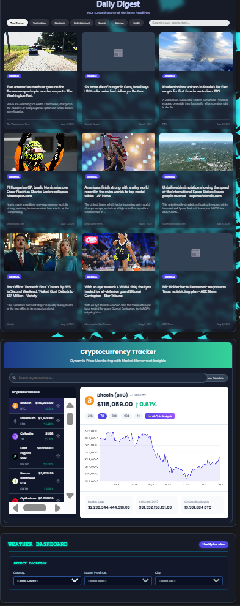

# InfoPulse Dashboard

InfoPulse is a modern, all-in-one dashboard built with React. It provides a real-time, at-a-glance view of global news headlines, cryptocurrency market data, and local weather forecasts.

  

## Features

*   **Dynamic News Feed:** Browse top headlines by category or search for specific topics, powered by the NewsAPI.
*   **Cryptocurrency Tracker:** View real-time crypto prices, historical charts, and get AI-powered investment analysis using the Google Gemini API.
*   **Weather Dashboard:** Get current weather conditions and a 5-day forecast for any location in the world, or use your current location.
*   **Animated Background:** Features a beautiful, dynamic Vanta.js background.

## Tech Stack

*   **Framework:** React
*   **Build Tool:** Create React App
*   **Styling:** CSS Modules with a modern "glassmorphism" design
*   **Data Fetching:** Axios & Fetch API
*   **APIs:** NewsAPI, OpenWeatherMap, CoinGecko, Google Gemini
*   **Charting:** Chart.js with react-chartjs-2

## Getting Started

### Prerequisites

*   Node.js (v14 or later)
*   npm

### Setup

1.  Clone the repository:
    ```sh
    git clone https://github.com/YOUR_USERNAME/InfoPulse.git
    ```
2.  Navigate into the project directory:
    ```sh
    cd InfoPulse
    ```
3.  Install dependencies:
    ```sh
    npm install
    ```
4.  **Set up your environment variables:**
    *   Create a file named `.env.local` in the root of the project.
    *   Copy the contents of `.env.example` into your new `.env.local` file.
    *   Add your personal API keys for each service.
    ```
    REACT_APP_NEWS_API_KEY=YOUR_NEWS_API_KEY
    REACT_APP_WEATHER_API_KEY=YOUR_OPENWEATHERMAP_API_KEY
    REACT_APP_GEMINI_API_KEY=YOUR_GEMINI_API_KEY
    ```

5.  Start the development server:
    ```sh
    npm start
    ```

The application should now be running on [http://localhost:3000](http://localhost:3000).# InfoPulse
